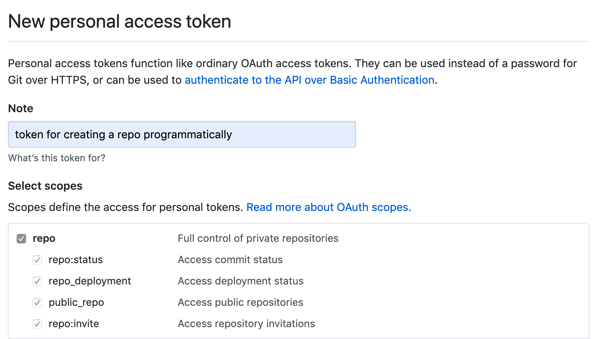

# Project Template

A moderately opinionated file structure template for computational research project

## Philosopy
Reproducibility and file organization have been continuously discussed across research communities (see [References](#references)).
However, as modern computational research project comes in all forms and sizes,  project templates are often opinionated and project-specific.

Here, we provide _best practice recommendations_ for a typical computational academic research project aiming to produce a written report such as journal article, master dissertation, or PhD thesis.

The core principles of this template are:
 * **Consistent** – follow certain structure and format (see Coding style)
 * **Simple** – easy to follow and clear enough for someone unfamiliar with the project
 * **Scalable** – can be used for small or big projects of many kinds
 * **Portable** – easy to import, export, and sync to various computing platforms (see [Computing platforms](#computing-platforms))

 This template is *not* intended to be a rigid project skeleton with strict formatting and rules, but rather a quick-to-build prototype body with detachable parts.

 The aims of this template is *to save time, improve reproducibility, and enable easy and quick navigation through the project*.

 Finally, a well-structured project sparks joy :sparkles:

 


## Pre-requisites
1. [python 3](https://docs.python.org/3/using/index.html)
1. [cookiecutter](https://cookiecutter.readthedocs.io/en/1.7.0/installation.html)
1. [git](https://git-scm.com/book/en/v2/Getting-Started-Installing-Git)
1. [GitHub account](https://help.github.com/en/articles/signing-up-for-a-new-github-account)
  (*Note*: UCL staff & students can register for a [free pro GitHub account](https://www.ucl.ac.uk/isd/services/research-it/research-software-development-tools/support-for-ucl-researchers-to-use-github))
1. [Google account](https://support.google.com/accounts/answer/27441?hl=en)
1. [Google Backup & Sync](https://www.google.com/drive/download/backup-and-sync/) (Windows / Mac only)
1. [ssh](https://www.ssh.com/ssh)
1. [Optional] [sshfs](https://www.digitalocean.com/community/tutorials/how-to-use-sshfs-to-mount-remote-file-systems-over-ssh)
1. [Optional] [rclone](https://rclone.org/)

## Recommended Workflow
### Initial set up
1. Prepare the pre-requisites softwares and accounts above
1. Generate a new [GitHub personal access token](https://github.com/settings/tokens/new), fill in the **Note** field and tick **repo** box under **Select scopes**, copy the generated token
    

### Set up local project directory and GitHub
1. Open Command Line Interface (e.g. Terminal in Mac)
1. Change directory to parent project directory

    `cd my_directory`

    ***NOTE*** if [using Google Backup & Sync](#sync-to-google-drive), this directory should be located inside the local copy of Google Drive

1. Run `cookiecutter` pointing to project template git repo

    `cookiecutter https://github.com/alhenry/project-template.git`
1. When prompted, enter the project title, project directory name, GitHub username,  GitHub repository name (make sure name is available), and [GitHub personal access token](#initial-set-up). Leave blank to use the default value (shown in square bracket).

### Sync to Google Drive
#### Using Google Backup & Sync
1. Create a local copy of Google Drive with [Google Backup & Sync](https://support.google.com/drive/answer/2374987?#)
1. Follow steps above to [set up local project directory with `cookiecutter`](#set-up-local-project-directory-and-github)
1. Choose [what to sync](https://support.google.com/drive/answer/2374987?) (default to sync everything)

#### Using rclone
1. Open Command Line Interface (e.g. Terminal in Mac)
1. Set up a new [rclone remote Google Drive](https://rclone.org/drive/)
1. Follow steps above to [set up local project directory with `cookiecutter`](#set-up-local-project-directory-and-github)
1. Sync the new local project directory to Google Drive
    * Sync everything

        ```
        cd my_project_local
        rclone sync . my_GDrive:my_project_GDrive --create-empty-src-dirs -u
        ```
    * Selective sync with `--filter-from` flag
        ```
        cd my_project_local
        rclone sync . my_GDrive:my_project_GDrive --create-empty-src-dirs \
            -u --filter-from .rclone-filter
        ```

1. Subsequent sync from/to Google Drive
    * Sync from Google Drive

    ```
    rclone copy my_GDrive:my_project_GDrive my_project_local \
        -u --filter-from .rclone-filter
    ```

    * Sync to Google Drive
    ```
    rclone copy my_project_local my_GDrive:my_project_GDrive \
        -u --filter-from .rclone-filter
    ```
*NOTE*:
* `-u` update only (skip newer files)
*  `.rclone-filter` is an arbitrary-named hidden file to pass [filtering rules](https://rclone.org/filtering/) to `--filter-from` argument. Think of it as `.gitignore` for `rclone copy`
* `rclone copy` can be replaced with `rclone sync` to make sure both local and remote directories have the same contents, ***HOWEVER*** `rclone sync` can *overwrite* the destination folder contents so please proceed with caution.
* ***Tip***: add `-n` or `--dry-run` flag before syncing to check which files are copied / replaced.

#### <To-do: Google Backup & Sync vs. rclone>

## Directory structure
The default project structure is outlined below:

```
./
├── .git/
|
├── admin/
|   └── meeting_notes.gsheet
|
├── data/
|   ├── 2020-01/
|   |   ├── iris.tsv
|   |   └── mtcars.csv
|   └── 2020-02/
|   
├── scripts/
|   ├── 2020-01/
|   |   ├── s01_data_generation.sh
|   |   ├── s02.1_calculate_desc_stats_table1.R
|   |   └── s02.2_figure1.ipynb
|   └── 2020-02/
|
├── exploratory/
|
├── results/
|   ├── 2020-01/
|   |   ├── table1.tsv
|   |   └── figure1.png
|   └── 2020-02/
|
├── writing/
|   ├── main_text.gdoc
|   ├── supplementary_table.gsheet
|   └── analysis_plan.gdoc
|
└── ...
```

#### Note
* **.git** - hidden folder for git version control

*  **admin** - Admin documents, e.g. meeting notes, applications, ethical approvals, MTA

* **data** - Read only data files used as input for analysis and results

* **scripts** - Analysis scripts

* **exploratory** - Scratch space for temporary output files / exploratory data analysis generated as part of the analysis, can be deleted before archiving

* **results** - output of data analysis e.g. tables, figures, jupyter notebook

* **writing** - Analysis write ups, subfolders can be created specifically for early analysis drafts and later on manuscript drafts and final editions ready for submission to specific journals (this can also include reviewer comments and reply)

<Note on date / chronological subfolders>

## Computing Platforms

This project template utilises the following platforms:
* **local** - local machine e.g. personal laptop, UCL machine

* **remote** - remote computing platform, typically a headless machine in HPC cluster (e.g. [UCL Myriad](https://wiki.rc.ucl.ac.uk/wiki/Myriad), UCL CS Cluster) or cloud computing services (e.g. [Amazon Web Service](https://aws.amazon.com/), [Google Computing Platform](https://cloud.google.com/)

* **GDrive** - Google Drive

* **GitHub** - GitHub

* **storage** - data storage space (for backup only) e.g. [UCL Research Data Storage Service](https://www.ucl.ac.uk/isd/services/research-it/research-data-storage-service), [UCL S: drive](https://www.ucl.ac.uk/isd/support-staff/s-drive-documentation/s-drive-how-it-works-permissions)


#### Which folders live in which platforms?
|             | local | remote | GDrive | GitHub | storage |
|-------------|:-----:|:------:|:------:|:------:|:-------:|
| **.git**        |   ✅   |    ✅   |        |    ✅   |         |
| **admin**       |   ✅   |        |    ✅   |        |         |
| **data**        |       |    ✅   |        |        |    ✅    |
| **scripts**     |   ✅   |    ✅   |        |    ✅   |         |
| **exploratory** |   ✅   |    ✅   |        |        |         |
| **results**     |       |    ✅   |    ✅   |        |         |
| **writing**     |   ✅   |        |    ✅   |        |         |


#### How to transfer / sync files across platforms?
|         | local         | remote        | GDrive                                | GitHub                                | storage       |
|---------|---------------|---------------|---------------------------------------|---------------------------------------|---------------|
| **local**   |               | ssh           | rclone<br>GBS                         | git                                   | ssh<br>rclone |
| **remote**  | ssh<br>rclone |               | rclone                                | git                                   | ssh<br>rclone |
| **GDrive**  | rclone<br>GBS | rclone        |                                       | rclone (via local)<br>GBS (via local) | rclone        |
| **GitHub**  | git           | git           | rclone (via local)<br>GBS (via local) |                                       | git           |
| **storage** | ssh<br>rclone | ssh<br>rclone | rclone                                | git                                   |               |

*Note*

* **ssh** - [Secure Shell protocol](https://www.ssh.com/ssh), also see [**sshfs**](https://www.digitalocean.com/community/tutorials/how-to-use-sshfs-to-mount-remote-file-systems-over-ssh) for mounting remote file system to local machine via ssh protocol
* **GBS** - [Google Backup & Sync](https://www.google.com/drive/download/backup-and-sync/)
* [**git**](https://git-scm.com/book/en/v2/Getting-Started-Installing-Git)
* [**rclone**](https://rclone.org/)


## References
**File organization**
- [A Quick Guide to Organizing Computational Biology Projects](https://journals.plos.org/ploscompbiol/article?id=10.1371/journal.pcbi.1000424)
- [MIT Comm Kit - File Structure](https://mitcommlab.mit.edu/broad/commkit/file-structure/)
- [The Turing Way - Research Data Management](https://the-turing-way.netlify.com/rdm/rdm.html)

**Coding style**
- General recommendations: [MIT Comm Kit - Coding and Comment Style](https://mitcommlab.mit.edu/broad/commkit/coding-and-comment-style/)
- Python: [Google Python Style Guide](https://google.github.io/styleguide/pyguide.html)
- R: [tydyverse style guide](https://style.tidyverse.org/)


**Other template**
- [Cookiecutter Data Science](https://drivendata.github.io/cookiecutter-data-science/)
- [R ProjectTemplate](http://projecttemplate.net/index.html)
